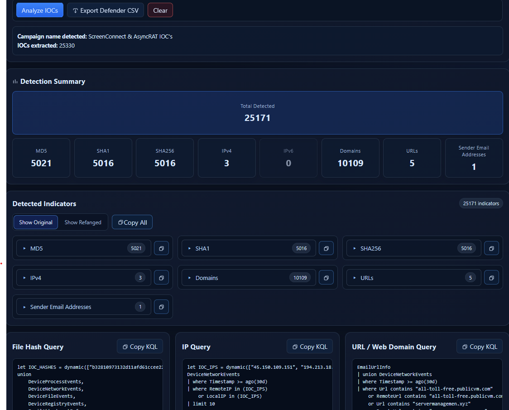
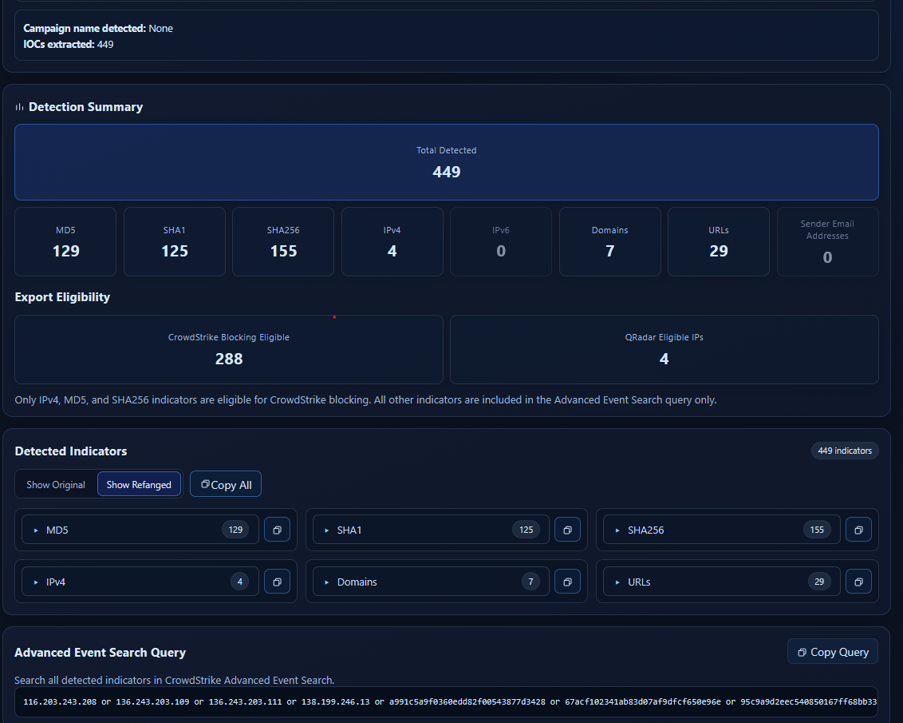
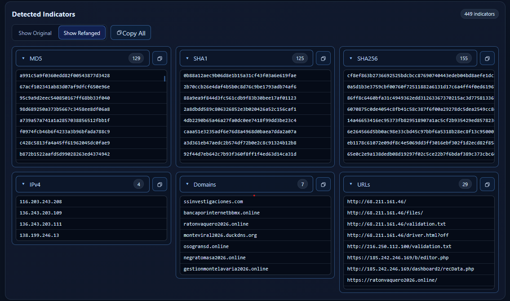
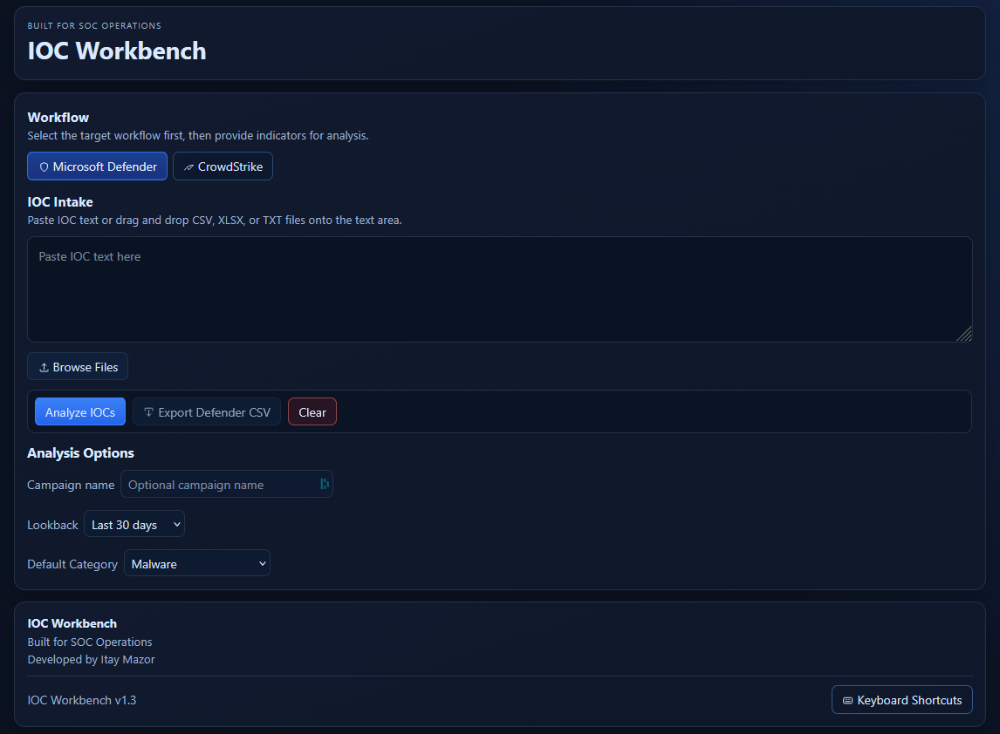

# IOC Workbench

A multi-platform SOC productivity tool for parsing, normalizing, investigating, and exporting Indicators of Compromise (IOCs) across **Microsoft Defender**, **CrowdStrike Falcon**, and **IBM QRadar**.

<p align="center">
  
</p>

---

## Highlights

- Multi-platform IOC workflows
- Microsoft Defender Advanced Hunting support
- CrowdStrike Falcon integration
- IBM QRadar export support
- React + FastAPI architecture

## Overview

IOC Workbench was built to eliminate repetitive manual work performed by SOC analysts when processing customer-provided Indicators of Compromise.

Instead of manually extracting IOCs, cleaning data, generating hunting queries and preparing platform-specific import files, IOC Workbench automates the entire workflow while keeping the analyst in control.

The application supports multiple security platforms and generates investigation queries and export files tailored to each workflow.

---

## Why IOC Workbench?

SOC analysts often receive Indicators of Compromise from customers in inconsistent formats, including emails, CSV files, spreadsheets, and copied text.

Preparing these indicators for investigation typically involves repetitive manual work such as extracting values, removing duplicates, classifying IOC types, generating hunting queries, and creating platform-specific import files.

IOC Workbench streamlines this workflow by automating these repetitive tasks while keeping analysts in control of the investigation and blocking process. The result is a faster, more consistent, and less error-prone workflow across multiple security platforms.

## Architecture Overview

IOC Workbench uses a React frontend and FastAPI backend to transform raw IOC input into platform-specific investigation queries and export files.



## Features

### IOC Processing

- Free-text IOC extraction
- CSV support
- TXT support
- XLSX support
- Automatic refanging
- IOC normalization
- Automatic IOC classification
- Duplicate removal
- Multi-file processing
- IOC accumulation across imports
- Campaign detection
- Manual campaign override

Supported IOC types:

- IPv4
- IPv6
- Domains
- URLs
- MD5
- SHA1
- SHA256
- Sender Email Addresses

---

## Microsoft Defender Workflow



Features:

- Separate KQL generation per IOC type
- Adjustable hunting lookback
- Defender IOC CSV export
- Campaign-aware metadata
- Detection summary
- Indicator preview
- One-click query copy

---

## CrowdStrike Falcon Workflow



Features:

- Advanced Event Search query generation
- Bulk IOC Blocking CSV export
- Blocking eligibility summary
- Configurable severity
- Configurable description
- Automatic platform mapping
- QRadar companion workflow

Supported blocking:

- IPv4
- MD5
- SHA256

---

## IBM QRadar Workflow

IOC Workbench can generate QRadar-compatible CSV files containing IPv4 indicators only.

Features:

- Headerless CSV
- IPv4 filtering
- One-click export
- Investigation guidance integration

---

## Indicator Classification



Indicators are automatically:

- Extracted
- Refanged
- Classified
- Deduplicated
- Organized by IOC type

Each group supports:

- Expand / Collapse
- Copy All
- Original value display
- Refanged value display

---

## Investigation Guidance

The application provides contextual investigation recommendations.

Examples:

- Continue IP investigations in QRadar
- Continue Sender Email investigations in Mail Relay / Forcepoint
- Workflow-specific guidance based on detected IOC types


---

# Tech Stack

## Frontend

- React
- Vite
- JavaScript
- HTML
- CSS
- Vitest

## Backend

- FastAPI
- Python
- Pydantic
- Pytest

---

# Project Structure

```text
ioc-workbench/
│
├── backend/
│   ├── app/
│   │   ├── exporters/
│   │   ├── models/
│   │   ├── routes/
│   │   ├── services/
│   │   └── main.py
│   └── tests/
│
├── frontend/
│   ├── src/
│   │   ├── components/
│   │   ├── services/
│   │   └── styles/
│   ├── public/
│   └── package.json
│
├── docs/
│   ├── architecture/
│   │   └── system-overview.svg
│   └── media/
│       ├── demo.gif
│       ├── overview.png
│       ├── defender-workflow.png
│       ├── crowdstrike-workflow.png
│       └── indicator-classification.png
│
├── README.md
└── .gitignore
```

---

# Getting Started

## Prerequisites

- Python 3.11+
- Node.js
- npm

---

## Backend

```bash
python -m venv .venv

# Windows
.venv\Scripts\activate

pip install -r backend/requirements.txt

uvicorn backend.app.main:app --reload
```

---

## Frontend

```bash
cd frontend

npm install

npm run dev
```

---

## Running Tests

### Backend

```bash
pytest
```

### Frontend

```bash
cd frontend

npm test
npm run build
```

---

# Screenshots

## Overview



---

## Microsoft Defender


---

## CrowdStrike Falcon


---

## IOC Classification


---

# Security Notice

IOC Workbench is intended as an analyst productivity tool.

Generated outputs should always be reviewed by a security analyst before being imported into production security platforms.

No customer data is included in this repository.

---

# Roadmap

Potential future enhancements:

- Additional SIEM integrations
- Additional EDR integrations
- Threat Intelligence enrichment
- Optional MISP integration
- Saved investigation profiles
- Additional workflow integrations
- REST API documentation

---

## Current Version

**v1.3.0**

---

# License

This project is licensed under the **MIT License**.

See the [LICENSE](LICENSE) file for details.